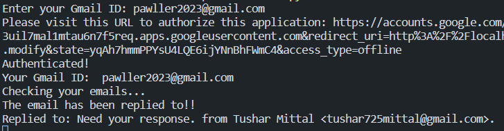
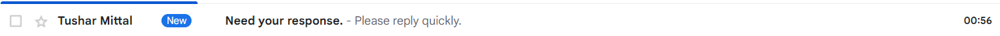
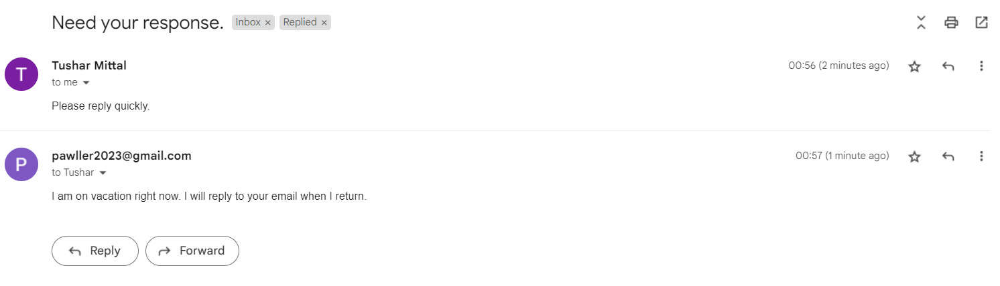
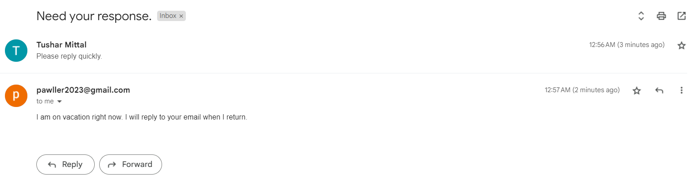

# Vacation Responder

A python script to automatically respond to new emails in a gmail account.

## Problem Statement

Build a vacation auto responder application that has the following functionalities:

- Checks for new emails in any given Gmail ID.
- Replies to emails that have no prior replies.
- Adds a label to the replied email and moves the email to the label.
- Repeats tasks in random intervals of 45 to 120 secs.
- Ensure no double replies are sent to any email at any point of time.

## Implementation

The `main` function in `vacation_responder.py` executed two functions

- `authenticate_google_user` from `auth.py` that authenticate the user with the given GmailID using the credentials from the JSON file and return the GmailID and credentials.
- `respond` from `responder.py` that checks for unread emails in the inbox, and if they are not already been replied to then replies them with the reply_message. This is repeated after every 45 to 120 seconds later. The responde function further uses two function from `messenger.py` -
  `create_message` that prepares a message in MIME format for an email and returns the encoded form of it.
  `send_message` that sends an email message and returns the message ID.

All the communication from gmail in these functions are done using the API methods provided by Google API python libraries. Please do the read the [documentation](https://developers.google.com/gmail/api/guides) to further understand it.

# Prerequisites

- [Python](https://www.python.org/downloads/)
- [credential.json(gmail api)](https://console.cloud.google.com/apis/library/gmail.googleapis.com)

## Setting Up

1. Run command - pip install -r requirements.txt
2. Add the credential.json file download from Google Cloud Platform to the project directory. Do remember to add http://localhost:8080 to Authorised redirect URIs. Also if the add your email to Test users in OAuth consent screen (if app is not published).

# Run Code

Then to execute code run command - python3 vacation_responder.py

I will ask for the email on which you want to enable the service. Once authenticated, it will check the new emails and will reply to it automatically.

New Mail arrives:

After auto reply:

Your email account

Receiver:

